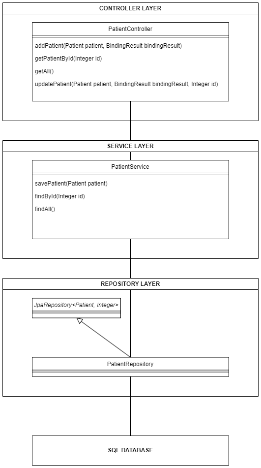

# OC_DA_JAVA_P9_Patient

Note microservice for [medilabo](https://github.com/SimonArduin/OC_DA_JAVA_P9_Medilabo)

This application allows users to interact with a SQL database through an API. The database contains identifying informations about patients.

It is built with Spring as a Maven project, using the following modules :
- Spring Data JPA
- Spring Data JDBC

The application configuration is defined in [application.properties](patient/src/main/resources/application.properties). By default, incoming requests are received on port 8000, and the SQL database is found on port 3306 with the name medilabo.

***
# CLASS DIAGRAM

